# Optimum Solutions Group — Platform Mapping & UML Diagrams

Global mapping of the website/platform with class, component, sequence, activity, and use case diagrams.

---

## 1. Platform Overview

| Layer | Technologies |
| ----- | ------------ |
| Frontend | React 18, TypeScript, Vite 5 |
| Routing | react-router-dom 6 |
| State/Data | @tanstack/react-query |
| UI | Radix UI, shadcn, Tailwind CSS |
| Forms | react-hook-form, zod |
| PWA | Service Worker, manifest.json |
| Analytics | web-vitals, custom analytics |

### Routes

| Path | Component | Purpose |
| --- | --- | --- |
| `/` | Index | Landing page (Hero, About, Services, IoT, Portfolio, Testimonials, FAQ, Contact) |
| `/component-showcase` | ComponentShowcase | UI component gallery |
| `/analytics` | AnalyticsPage | Analytics dashboard |
| `/pwa` | PWAPage | PWA info & status |
| `*` | NotFound | 404 page |

---

## 2. Class Diagram

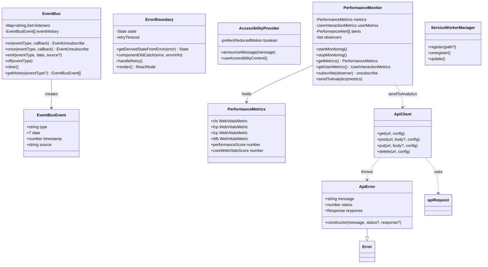

---

## 3. Component Diagram

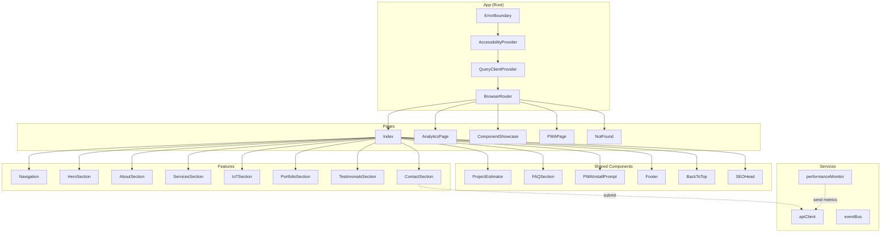

---

## 4. Sequence Diagrams

### 4.1 Page Load & Initialization

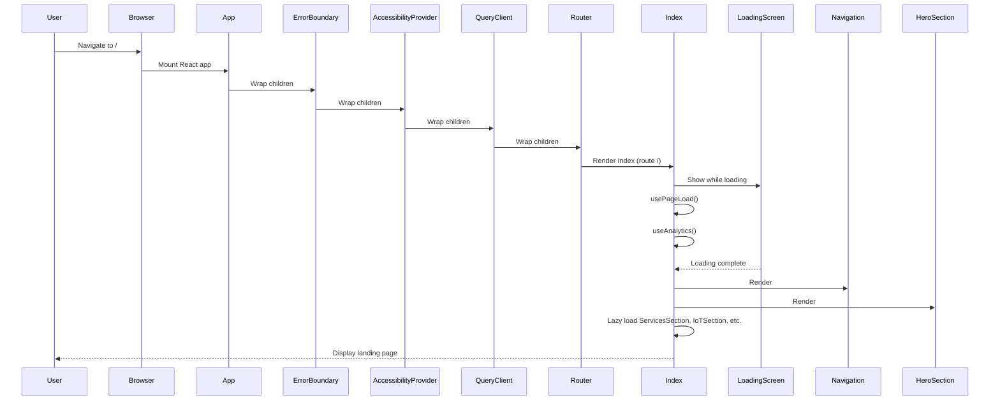

### 4.2 Contact Form Submission

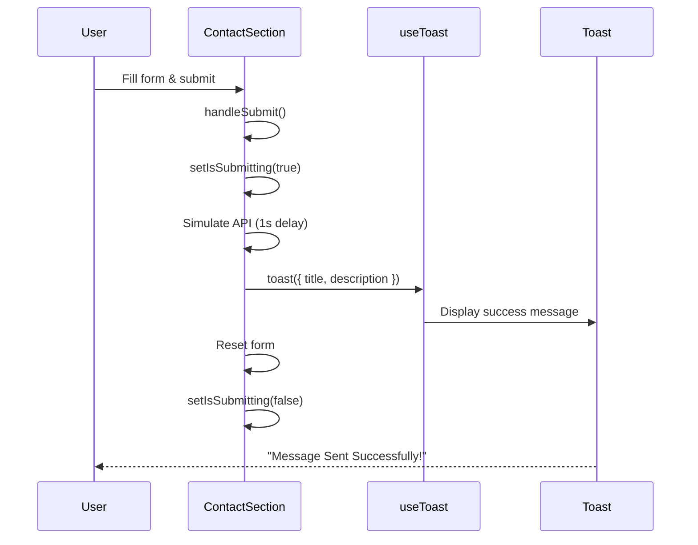

### 4.3 Performance Metrics to Analytics

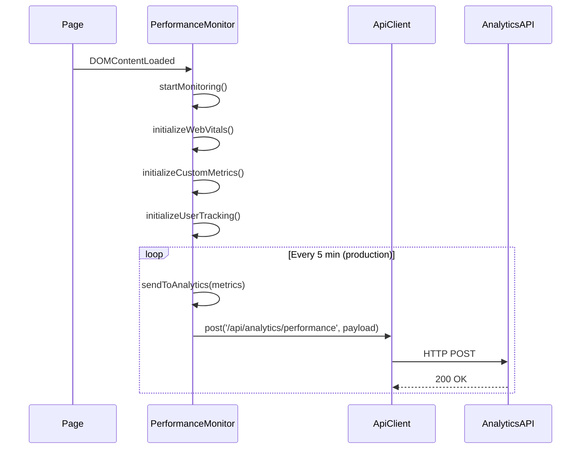

---

## 5. Activity Diagram (Action Diagram)

### 5.1 User Navigation Flow

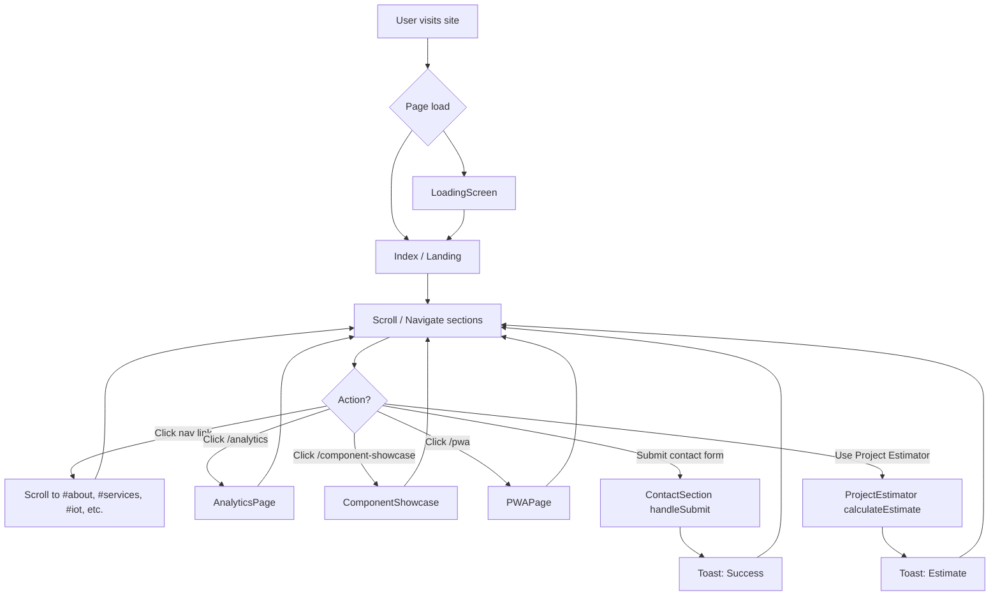

### 5.2 Error Handling Flow

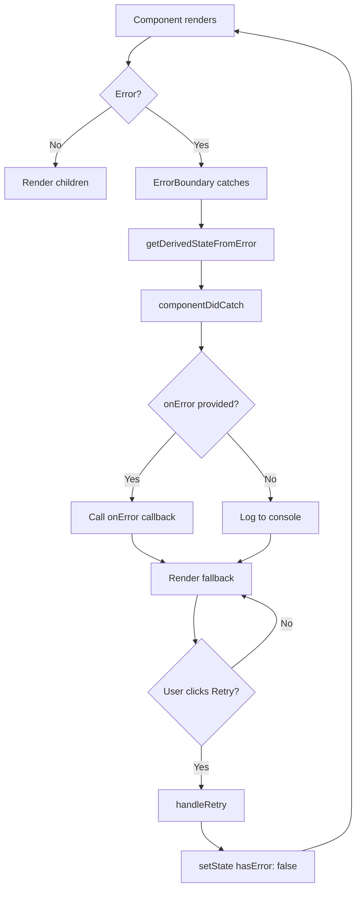

### 5.3 PWA Offline Flow

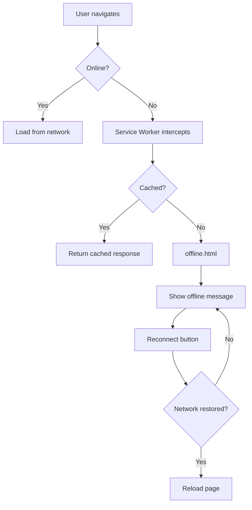

---

## 6. Use Case Diagram

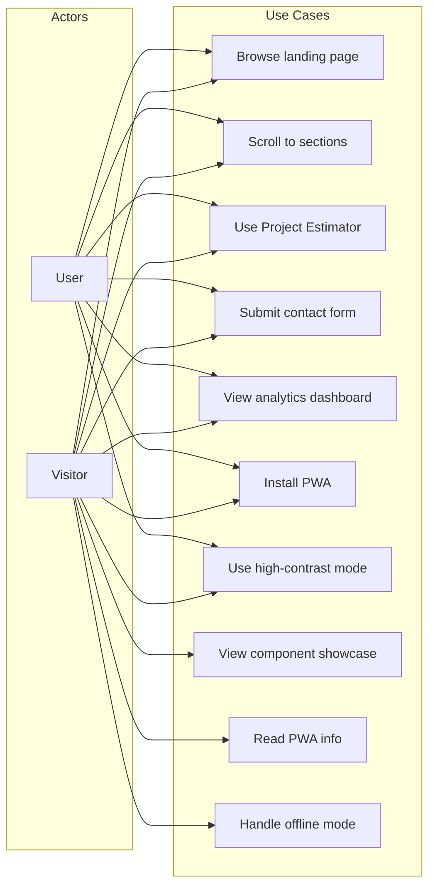

### Use Case Descriptions

| Use Case | Actor | Description |
| --- | --- | --- |
| Browse landing page | Visitor, User | View Hero, About, Services, IoT, Portfolio, Testimonials, FAQ, Contact |
| Scroll to sections | Visitor, User | Use navigation links to jump to #about, #services, #iot, #portfolio, #faq, #contact |
| Use Project Estimator | Visitor, User | Select project type, design, environment, features; get price estimate; submit for consultation |
| Submit contact form | Visitor, User | Fill name, email, company, project type, message; submit; receive toast confirmation |
| View analytics dashboard | Visitor, User | Navigate to /analytics; view page views, events, Core Web Vitals |
| Install PWA | Visitor, User | Accept PWA install prompt; add to home screen |
| Use high-contrast mode | Visitor, User | Toggle high-contrast for accessibility |
| View component showcase | Visitor, User | Navigate to /component-showcase; browse UI components |
| Read PWA info | Visitor, User | Navigate to /pwa; view PWA status and capabilities |
| Handle offline mode | Visitor, User | When offline, see offline.html with reconnect option |

---

## 7. State Diagram

### 7.1 ErrorBoundary State

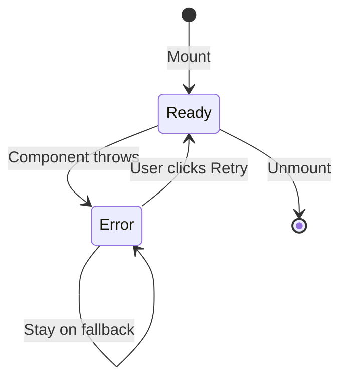

### 7.2 PWA Install Prompt State

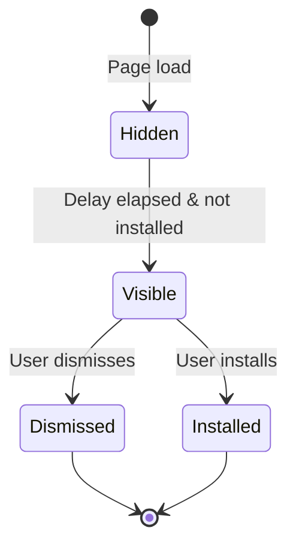

### 7.3 Contact Form State

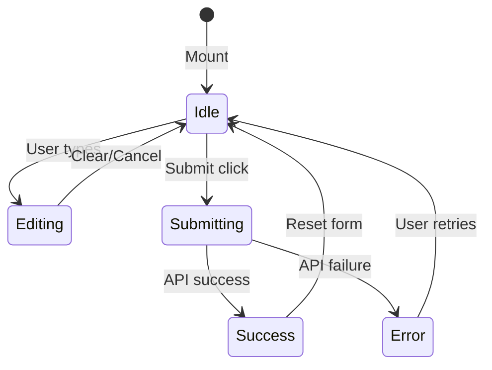

---

## 8. Entity-Relationship Diagram

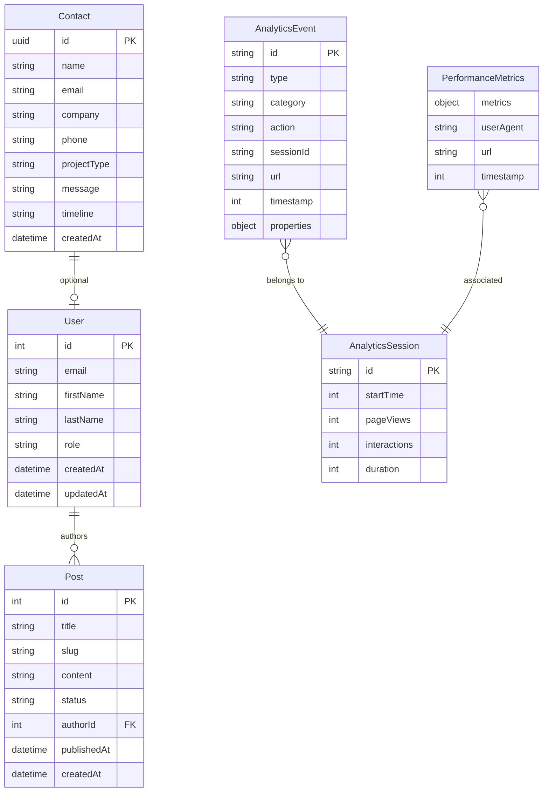

---

## 9. Deployment Diagram

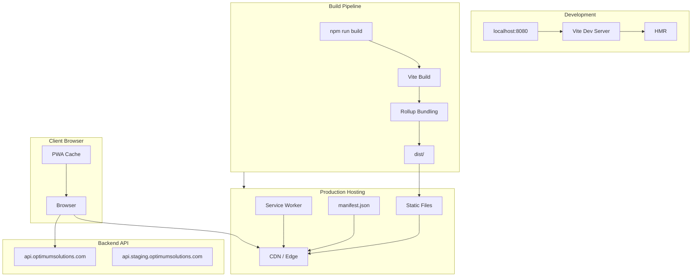

---

## 10. C4 Model Diagrams

### 10.1 C4 Level 1 — System Context

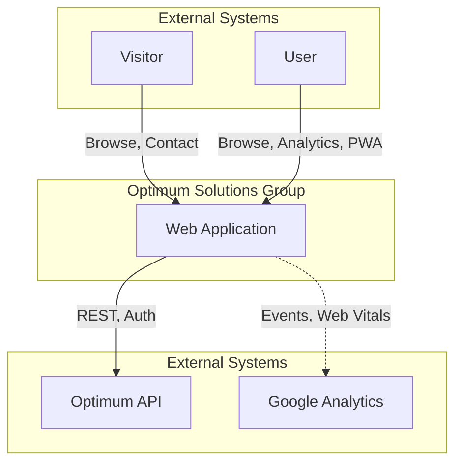

### 10.2 C4 Level 2 — Container

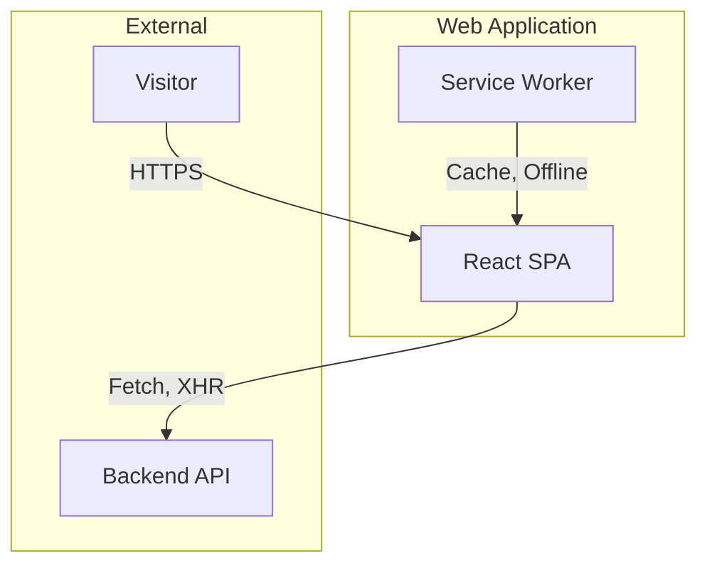

### 10.3 C4 Level 3 — Component (Landing Page)

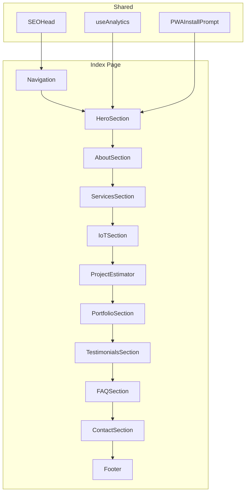

---

## 11. Export & Draw.io

### Export to PNG/SVG

Run `npm run diagrams:export` to generate PNG and SVG files from all Mermaid diagrams. Output: `docs/architecture/diagrams/`.

Requires: `@mermaid-js/mermaid-cli` (installed with `--legacy-peer-deps` due to puppeteer version).

### Draw.io Structure

See [Draw.io Structure Guide](../guides/drawio-structure-guide.md) for how to recreate these diagrams in Draw.io (diagrams.net).

---

## 12. Key Files Reference

| Category | Path |
| -------- | ---- |
| App entry | `src/App.tsx`, `src/main.tsx` |
| Pages | `src/pages/Index.tsx`, `AnalyticsPage.tsx`, `ComponentShowcase.tsx`, `PWAPage.tsx`, `NotFound.tsx` |
| Features | `src/features/navigation`, `hero`, `about`, `services`, `iot-solutions`, `portfolio`, `testimonials`, `contact` |
| Services | `src/shared/services/apiClient.ts`, `eventBus.ts` |
| Utils | `src/shared/utils/performanceMonitor.ts`, `errorHandler.ts`, `serviceWorkerManager.ts` |
| Shared components | `src/shared/components/ErrorBoundary.tsx`, `AccessibilityProvider.tsx`, `ProjectEstimator.tsx`, `ContactSection` (feature) |
| API | `docs/api/openapi.yaml` |
